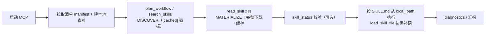

# codex-skills-mcp

> 🧠 Codex-Skills 技能库的 MCP (Model Context Protocol) Server — 让任意 AI 编程工具都能检索、阅读和使用 180+ 专业技能。

## 这是什么

一个独立的 MCP Server，为 [codex-skills](https://github.com/Zhan-ZhangZ/codex-skills) 技能库提供标准化的 AI 工具接入协议。

- **无需先下载全部技能文件**：启动只拉取轻量清单（约 108KB），技能全文按需加载；
- **180+ 技能、14 个分类**：技能库由专家在远端持续维护，用户端零操作；
- **内置国内网络加速**：自动回退链，国内网络免翻墙可用。

| 特性 | 说明 |
|------|------|
| **8 个 MCP Tools** | search_skills, read_skill, load_skill_file, list_skill_files, list_categories, plan_workflow, skill_status, diagnostics |
| **Agent 行为合约** | server instructions + 工具描述 + 返回体尾部三层强化同一套 5 步工作流（见 [docs/AGENT-PROTOCOL.md](docs/AGENT-PROTOCOL.md)） |
| **缓存状态可见** | search/plan 结果带 `[cached]` 徽标；read_skill 返回 `local_path`；skill_status 深度校验完整性 |
| **活动日志与诊断** | 全部工具调用/下载/错误落 JSONL 日志；diagnostics 一键审计 |
| **三层渐进加载** | 检索(~500 tokens) → 阅读(~5K tokens) → 深入(按需) |
| **中文搜索优化** | CJK bigram 分词 + Leading Words 权重 |
| **零外部 AI 依赖** | 纯关键词搜索，不需要 embedding 模型 |
| **双传输模式** | stdio（本地）+ HTTP（远程） |
| **自动网络加速** | GitHub 直连 → jsDelivr → gh-proxy.com → ghfast.top 四级回退 |
| **增量缓存** | 技能文件按大小比对断点续传，重复使用不重复下载 |

## 快速开始

### 1. 远程模式（默认，零配置，推荐）

```bash
npx -y codex-skills-mcp@latest
```

无需安装、无需指定任何路径。启动后自动完成：

1. 从远端技能库拉取清单 `skills_manifest.json`（约 108KB，仅首次）；
2. 建立本地搜索索引（毫秒级）；
3. 技能文件按需下载，缓存在 `~/.codex-skills-cache/`（可用 `--cache-dir` / `CODEX_SKILLS_CACHE_DIR` 覆盖）。

### 2. 本地模式（可选）

适用于离线开发或使用本地技能库副本：

```bash
cd codex-skills-mcp
npm install
npm run build
node dist/index.js --skills-dir /path/to/codex-skills
```

### 3. HTTP 模式（远程客户端）

```bash
# 远程模式：无需 --skills-dir，自动拉取远端技能库
node dist/index.js --http --port 3456

# 本地模式：加 --skills-dir 指定本地技能库
node dist/index.js --skills-dir /path/to/codex-skills --http --port 3456
```

启动后：

- MCP 端点：`http://localhost:3456/mcp`（POST / GET / DELETE，支持 `mcp-session-id` 会话管理）
- 健康检查：`http://localhost:3456/health`

```bash
curl http://localhost:3456/health
# 预期输出
{"status":"ok","name":"codex-skills-mcp","version":"1.2.1","skills":181}
```

## 客户端配置

### Codex / ChatGPT 桌面端（stdio）

**方式一：通过 CLI 快速添加（推荐）**

```bash
codex mcp add codex-skills -- npx -y codex-skills-mcp@latest
```

**方式二：编辑 `~/.codex/config.toml` 添加**

```toml
[mcp_servers.codex-skills]
command = "npx"
args = ["-y", "codex-skills-mcp@latest"]
```

若使用本地技能库副本，可改为：

```toml
[mcp_servers.codex-skills]
command = "node"
args = ["/path/to/codex-skills-mcp/dist/index.js", "--skills-dir", "/path/to/codex-skills"]
```

### Claude Desktop

编辑 `~/Library/Application Support/Claude/claude_desktop_config.json`：

```json
{
  "mcpServers": {
    "codex-skills": {
      "command": "npx",
      "args": ["-y", "codex-skills-mcp@latest"]
    }
  }
}
```

### Cursor

编辑项目根目录 `.cursor/mcp.json`：

```json
{
  "mcpServers": {
    "codex-skills": {
      "command": "npx",
      "args": ["-y", "codex-skills-mcp@latest"]
    }
  }
}
```

### Windsurf / VS Code + Copilot

在 MCP 配置中添加同样的 command + args（stdio 模式）。

### 远程 HTTP 客户端

如果你的客户端需要以远程 HTTP 地址接入 MCP（例如 ChatGPT 桌面端集成场景）：

```bash
node dist/index.js --http --port 3456
ngrok http 3456
```

将 `https://xxxx-xxxx.ngrok-free.app/mcp` 填入客户端的 MCP Server URL。

> 💡 ngrok 免费版每次重启会更换地址；需要固定地址可使用付费版或其他隧道工具（如 Cloudflare Tunnel）。

## 工作原理



| 阶段 | 行为 | 耗时 |
|------|------|------|
| 启动 | 拉取/加载清单 + 建索引 | 秒级 |
| 搜索 | 本地索引关键词打分 | 毫秒级 |
| 取技能 | 2 次 GitHub API 列出文件 → 并发下载缺失文件 | 首次数秒，之后走缓存 |

### 网络加速回退链

所有远端文件请求按顺序自动回退，无需任何参数：

1. **GitHub 官方直连**（3 秒超时）；
2. **jsDelivr CDN**（10 秒超时，国内有节点）；
3. **gh-proxy.com**（10 秒超时）；
4. **ghfast.top**（10 秒超时）。

前一个节点失败时自动降级到下一个；全部失败才会报错。

### Agent 标准工作流（行为合约）

服务端通过 initialize instructions、工具描述、返回体尾部三层向 Agent 强化同一套协议（措辞单点维护于 `src/lib/protocol.ts`）：

1. **DISCOVER** — `plan_workflow` / `search_skills` 检索；`[cached]` 徽标 = 已在本地，分数相近优先选；
2. **SELECT** — 选出覆盖任务的最小技能组合；
3. **MATERIALIZE（必做）** — 对每个选定技能调用 `read_skill`，完整下载到本地并返回 `local_path`；
4. **EXECUTE** — 严格按 SKILL.md 执行，脚本从 `local_path` 运行，禁止凭通用知识自行替代；
5. **VERIFY & REPORT** — `skill_status` 校验缓存完整性；`diagnostics` 排障并审计。

### 日志与诊断

- 活动日志：`~/.codex-skills-cache/logs/mcp-activity-YYYY-MM-DD.jsonl`（按天分文件，保留 14 天，best-effort 不影响主流程）；
- 记录事件：`tool_call` / `tool_result` / `download_skill_start` / `download_skill_complete` / `tool_error` / `server_start`；
- `diagnostics` 工具返回：近期调用、近期错误、缓存统计（已缓存技能数/体积）、清单新鲜度与配置摘要；
- 本地模式（`--skills-dir`）不写文件日志，仅镜像到 stderr。

### 缓存与增量同步

- 清单与技能文件缓存在 `~/.codex-skills-cache/`，二次启动秒级完成；
- 每个技能带 `.codex-skills.tree.json` 标记（文件列表 + 完成状态）；
- 已完整下载的技能直接本地读取，不重复请求远端；
- 中断的下载支持断点续传：按文件大小比对，只补拉缺失/不完整的文件；
- 技能文件并发下载，默认 16（可用 `--download-concurrency` 调整）；
- 需要强制同步远端最新内容时，删除 `.codex-skills-cache/` 后重启即可。

## MCP Tools

### 🔍 search_skills

搜索技能库，Agent 的主入口（协议 STEP 1）。结果带 `[cached]` 徽标与"下一步必须 read_skill 物化"的协议尾部。

```
input:  { query: "前端性能优化", category?: "01_代码工程与架构", limit?: 8 }
output: 按相关度排序的技能列表（名称、分类、分数、描述）
```

### 📋 list_categories

列出所有技能分类和数量。

```
input:  {}
output: 14 个分类 + 各自的技能数量
```

### 📖 read_skill

物化技能（协议 STEP 3，执行前必调）：完整下载技能目录到本地缓存（已缓存则秒回），返回 SKILL.md 指令 + 文件结构 + 依赖 + **Cache & Execution 段（local_path / 完整性 / setup 命令）** + 子技能。

```
input:  { name: "MediaCrawler" }
output: { instructions, structure, dependencies, sub_skills }
```

### 📂 load_skill_file

按需读取技能内的任意文件。

```
input:  { skill_name: "KrillinAI", file_path: "README.md" }
output: { content, size_bytes }
```

> 单文件上限 500KB；二进制文件返回占位说明而非内容；路径穿越会自动拦截。

### 🗂️ list_skill_files

浏览技能的文件树（不读内容）。

```
input:  { skill_name: "remotion-skills", path?: "src", max_depth?: 2 }
output: 目录树
```

### 🔗 plan_workflow

给定任务描述，产出可组合技能的**有序执行计划草稿**（带 `[cached]` 徽标），并强制"先 read_skill 全部选定技能再开工"。

```
input:  { task_description: "把技术博客做成小红书图文" }
output: 推荐技能列表 + 分类分组
```

### ✅ skill_status

深度校验一个或多个技能的本地缓存完整性（逐文件大小核对，只读不下载）。

``
input:  { names: "KrillinAI, videocut-skills" }
output: cached/complete/local_path/files_total/files_missing/completed_at
```

### 🩺 diagnostics

审计与排障：近期工具调用、近期错误（活动日志）、缓存统计、清单新鲜度、配置摘要。

``
input:  { include_log?: true, log_lines?: 20 }
output: Server / Manifest / Local skill cache / Recent errors / Recent tool calls
```

## 使用流程（示例）

```
用户: "帮我把这个视频翻译成中文字幕"

Agent → plan_workflow("把视频翻译成中文字幕")          # DISCOVER：拿到组合计划
Agent → search_skills("视频字幕翻译")                   # DISCOVER：精确定位
     → 命中: KrillinAI, videocut-skills, VideoClaw      # [cached] 徽标优先

Agent → read_skill("KrillinAI")                         # MATERIALIZE：完整下载
     → 返回 SKILL.md + local_path + 依赖
Agent → read_skill("videocut-skills")                   # 每个选定技能都要物化

Agent → skill_status("KrillinAI, videocut-skills")      # VERIFY：确认缓存完整

Agent → 按 SKILL.md 从 local_path 执行任务               # EXECUTE：严格遵循指令
     → 需要补充文件时 load_skill_file(...)
```

## 配置参考

| 参数 | 默认值 | 说明 |
|------|--------|------|
| `--skills-dir <path>` | - | 本地技能库目录（指定后进入本地模式） |
| `--local` | - | 强制本地模式（从 cwd 或 `--skills-dir` 查找清单） |
| `--github-repo` | `Zhan-ZhangZ/codexprojec` | 远端技能库仓库 |
| `--github-branch` | `main` | 远端分支 |
| `--github-path` | `codex-skills` | 技能库在仓库内的目录 |
| `--github-token` | 自动从 git 凭据 / `GITHUB_TOKEN` 获取 | GitHub API 鉴权 |
| `--http` | - | 启动 HTTP 模式 |
| `--port` | `3456` | HTTP 端口 |
| `--download-concurrency` | `16` | 技能文件并发下载数 |
| `--manifest-ttl <秒>` | `86400` | 清单缓存有效期（0 = 永不刷新；设小值如 60 可让新技能更快出现） |
| `--cn-mirror` | - | ⚠️ 已废弃（兼容保留）：网络加速现为自动回退链，此参数不再生效 |

环境变量：`CODEX_SKILLS_DIR`（本地技能库路径）、`GITHUB_TOKEN`、`CODEX_SKILLS_DOWNLOAD_CONCURRENCY`。

技能库清单（`skills_manifest.json`）为 JSON 数组，每项包含 `name` / `description` / `category` / `folder` / `relative_path` 五个字段。

## 常见问题

| 问题 | 处理 |
|------|------|
| Agent 读了 SKILL.md 却不按指令执行 | v1.4.0 起三层合约强制 5 步协议；仍异常时用 `diagnostics` 审计该 Agent 实际调用序列 |
| 想看 Agent 到底做了什么 | `diagnostics` 或直接读 `~/.codex-skills-cache/logs/mcp-activity-*.jsonl` |
| npx 首次运行较慢 | 首次需下载 npm 包 + 拉取清单，属正常；之后走缓存 |
| 日志出现 `Network warning` | 当前加速节点失败，自动降级到下一个，可忽略 |
| 想强制更新技能内容 | 删除 `.codex-skills-cache/` 后重启，或设 `--manifest-ttl 60` 让清单自动高频刷新 |
| 仓库新增了技能但搜不到 | 可能是 CDN 旧清单缓存所致：清单现在优先直连 GitHub 权威源；仍异常时删除 `.codex-skills-cache/skills_manifest.json` 再重启 |
| `load_skill_file` 读大文件失败 | 单文件上限 500KB，属保护设计 |
| GitHub API 限流 | 每个技能仅 2 次 API 调用，已缓存技能不再请求；未登录配额 60 次/小时 |
| 工具列表里看不到 MCP | 客户端未重启，重启会话即可 |

## 技术栈

- TypeScript + ESM
- `@modelcontextprotocol/sdk` v1.12+
- `express` v5（仅 HTTP 模式）
- `zod` v3 运行时 schema 验证
- Node.js 18+

## License

MIT
